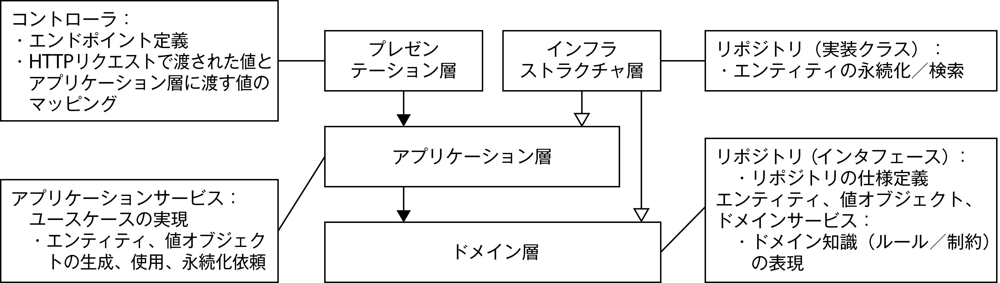

# About
WEB+DB PRESS Vol.113 に掲載されている「体験 ドメイン駆動設計 モデリングから実装までを一気に制覇」の2〜4章におけるサンプルコードです。なお、解説用のコードのため、アプリケーション起動やテスト実行はできませんのでご了承ください。

# アーキテクチャ
本サンプルでは、特集本文の紹介のとおり、オニオンアーキテクチャを採用しています。

(WEB+DB PRESS Vol.113より)

アプリケーション層、ドメイン層、インフラストラクチャ層のコードが含まれており、プレゼンテーション層については省略しています。

# パッケージ構造

`org.littlahands.dddsample.dddsample` 以下のパッケージ `v1` 〜 `v4` に、本文中のバージョン1から4までのコードが一通り入っています。v1から順に見ればリファクタリングの様子が追えるようになっています。

## 参考記事
DDDで使用するアーキテクチャついては、以下ブログ記事に詳細な説明がありますので、よろしければご参照ください。

* [ドメイン駆動設計で実装を始めるのに一番とっつきやすいアーキテクチャは何か](https://little-hands.hatenablog.com/entry/2017/10/04/231743)
* [ドメイン駆動 + オニオンアーキテクチャ概略](https://little-hands.hatenablog.com/entry/2017/10/11/075634)
* [新卒にも伝わるドメイン駆動設計のアーキテクチャ説明](https://little-hands.hatenablog.com/entry/2018/12/10/ddd-architecture)

# 著者
* 名前: 松岡 幸一郎
* ブログ: https://little-hands.hatenablog.com/entry/top
* Twitter: [@little_hand_s](https://twitter.com/little_hand_s)

* 名前: 成瀬 允宣
* ブログ: https://nrslib.com/
* Twitter: [@nrslib](https://twitter.com/nrslib)

## ご質問、問い合わせなど
* 記事内容やDDDに関するご質問、お問い合わせは[質問箱](https://peing.net/ja/little_hands)、もしくは上述のTwitterで受け付けています。お気軽にご相談ください。

